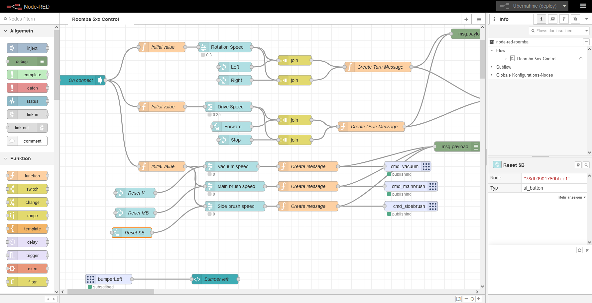
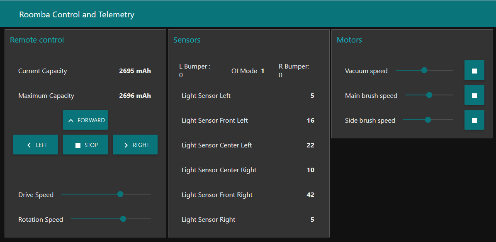

# Roomba 5xx support for ROS (Robot Operating System)

An implementation of a ROS base controller and other utilities for the Roomba 5xx platform based on the Roomba Open Interface
Specification.

This implementation has been developed and tested on ROS Melodic.

## Provided Nodes

### basecontroller.py

`basecontroller.py` is a base controller (robot driver) for the Roomba. It takes ros commands and sends them to a connected
Roomba. Connection to the Roomba is established over a serial interface.

This base controller uses the Roomba wheel encoder counts to get a better estimate of the robot odometry position and velocity. The internal Roomba sensors lack precision, depending on the model and firmware version. Using the wheel encoder values gives the best results. Please note that there is no sensor fusion involved, so odometry tends to drift over time. Please combine this node with a laser scanner to get better results of even make if workable with the ROS navigation stack.

However, this base controller works perfectly with [teleop_twist_keyboard](http://wiki.ros.org/teleop_twist_keyboard). There is
also a [Node-RED Dashboard](https://nodered.org/) available in the node-red-roomba directory.

#### Subscribed Topics

* `cmd_vel` ([geometry_msgs/Twist](http://docs.ros.org/en/api/geometry_msgs/html/msg/Twist.html))
  Velocity commands to the robot.
* `cmd_mainbrush` (int16)
  Motorspeed of the main brush. -127 to +127. 0 = Off
* `cmd_sidebrush` (int16)
  Motorspeed of the side brush. -127 to +127. 0 = Off
* `cmd_vacuum` (int16)
  Motorspeed of the vacuum. 0 to +127. 0 = Off

#### Published Topics

* `odom` ([nav_msgs/Odometry](http://docs.ros.org/en/api/nav_msgs/html/msg/Odometry.html))
  Odometry readings from the robot.
* `batteryCharge` (int16)
  Charge of the battery in mAh.
* `batteryCapacity` (int16)
  Capacity of the battery in mAh.
* `bumperLeft` (int16)
  Status of the bumper. 1 = triggered, 0 = not triggered. Only state change are published
* `bumperRight` (int16)
  Status of the bumper. 1 = triggered, 0 = not triggered. Only state change are published
* `wheeldropLeft` (int16)
  Status of wheel. 1 = dropped, 0 = not dropped. Only state change are published
* `wheeldropRight` (int16)
  Status of wheel. 1 = dropped, 0 = not dropped. Only state change are published
* `lightBumperLeft` (int16)
  Value for the left Light-Bumper (0..4095)
* `lightBumperFrontLeft` (int16)
  Value for the front-left Light-Bumper (0..4095)  
* `lightBumperCenterLeft` (int16)
  Value for the center-left Light-Bumper (0..4095)  
* `lightBumperCenterRight` (int16)
  Value for the center-right Light-Bumper (0..4095)  
* `lightBumperFrontRight` (int16)
  Value for the front-right Light-Bumper (0..4095)  
* `lightBumperRight` (int16)
  Value for the right Light-Bumper (0..4095)
* `oimode` (int16)
  The current mode of the open interface (0 = Off, 1 = Passive, 2 = Save, 3 = Full)

#### Parameters

* `serialport` (string, default: /dev/serial0)
  The serial port where the Roomba can be found.
* `baudrate` (int, default: 115200)
  The baud rate for serial communication.
* `fullRotationInSensorTicks` (int, default: 1608)
  Wheel encoder counts for a full 360 degree rotation. Is individual for each Roomba depending on tyre usage etc. 
* `ticksPerCm` (float, default: 22.5798)
  Wheel encoder counts for a movement of 1 cm. Is individual for each Roomba depending on tyre usage etc.
* `robotWheelDistanceInCm` (float, default: 25.0)
  The difference between the two robot wheels. Depends on the Roomba model.
* `pollingintervalionhertz` (int, default: 60)

## Installation

TODO

## Node-RED Dashboard

TODO

Example Node-RED flow to control the Roomba:

Example Node-RED dashboard for the Roomba:

